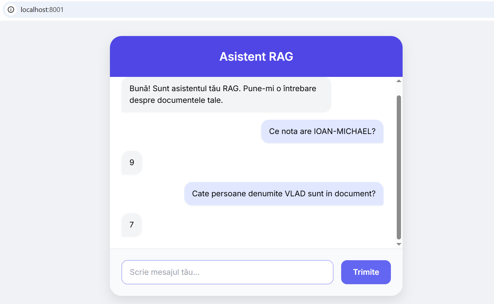
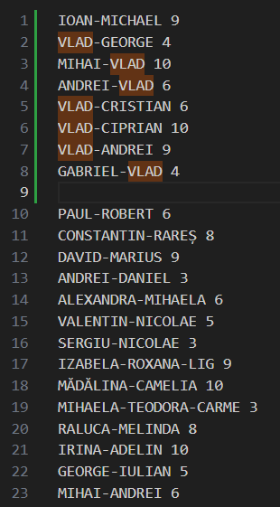

# RAG Chatbot

### 1. Descriere Generală

Acest proiect oferă o soluție completă pentru un chatbot RAG personalizat. Acesta îți permite să încarci propriile documente (fișiere `.pdf` și `.txt`) într-o bază de date vectorială (ChromaDB). Când un utilizator pune o întrebare, sistemul extrage fragmente relevante din documentele tale, le combină cu întrebarea originală și le trimite către modelul Google Gemini pentru a genera un răspuns contextualizat.

### 2. Funcționalități

* **Suport Multi-Document:** Procesează și indexează fișiere `.pdf` și `.txt`.
* **Generare AI cu Gemini:** Utilizează modelul Google Gemini (ex: `gemini-2.5-pro`) pentru înțelegerea limbajului natural și generarea răspunsurilor.
* **Bază de Date Vectorială Persistentă:** Folosește ChromaDB pentru stocarea și regăsirea eficientă a fragmentelor de documente.
* **Backend FastAPI:** O interfață API REST robustă și asincronă pentru comunicarea cu frontend-ul.
* **Frontend Web Simplu:** O interfață utilizator bazată pe HTML, CSS și JavaScript, ușor de utilizat și de personalizat.
* **Chunking:** Procesul de împărțire a documentelor în fragmente mai mici, cu posibilitate de suprapunere, pentru o regăsire mai eficientă.
* **Caching:** Utilizează `lru_cache` pentru a îmbunătăți performanța prin stocarea în memorie a rezultatelor interogărilor ChromaDB și a răspunsurilor Gemini, optimizand performanta pentru apelurile repetitive.
* **Docker:** Implementare ușoară și portabilă folosind containere Docker pentru backend și frontend.

### 3. Tehnologii Utilizate

* **Backend:**
    * Python 3.10+
    * [FastAPI](https://fastapi.tiangolo.com/) - Cadrul web pentru API.
    * [Uvicorn](https://www.uvicorn.org/) - Server ASGI pentru FastAPI.
    * [ChromaDB](https://www.trychroma.com/) - Bază de date vectorială.
    * [Google Generative AI SDK](https://pypi.org/project/google-generativeai/) - Interacțiunea cu modelul Gemini.
    * [PyPDF2](https://pypi.org/project/PyPDF2/) - Pentru extragerea textului din PDF-uri.
    * [python-dotenv](https://pypi.org/project/python-dotenv/) - Pentru gestionarea variabilelor de mediu.
* **Frontend:**
    * HTML5
    * CSS3 (cu [Tailwind CSS CDN](https://tailwindcss.com/docs/installation/play-cdn))
    * JavaScript

 ### 4. Structura Proiectului

```plaintext
├── app/
│   ├── init.py
│   ├── api.py           # Definiții API FastAPI, rute și gestionarea CORS
│   ├── config.py        # Setări globale ale aplicației și variabile de mediu
│   ├── main.py          # Punctul de intrare al aplicației backend Uvicorn
│   ├── rag_service.py   # Logica principală RAG (interogare ChromaDB, generare Gemini)
│   └── vector_db.py     # Logica de extragere, chunking și persistență ChromaDB
├── documents/           # Director pentru documentele tale (.pdf, .txt)
├── chroma_db/           # Director unde ChromaDB stochează datele persistent (creat automat)
├── .env                 # Fișier pentru variabilele de mediu (ex: GEMINI_API_KEY)
├── Dockerfile           # Instrucțiuni pentru construirea imaginii Docker
├── docker-compose.yml   # Definește serviciile Docker pentru backend și frontend
├── frontend.py          # Server Python simplu pentru fișierele statice ale frontend-ului
├── interface.html       # Fișierul HTML al interfeței chatbot-ului
├── interface.css        # Stiluri CSS pentru interfață
├── interface.js         # Logica JavaScript pentru interactivitatea frontend-ului
├── requirements.txt     # Dependințe Python ale proiectului
└── README.md
```

### 5. Configurare și Rulare (Local - Mediu Virtual) - Metoda 1:

Această metodă este recomandată pentru dezvoltare și testare rapidă, fără a implica Docker.

1.  **Clonează repozitoriul:**
    ```bash
    git clone https://github.com/ioanmh21/RAG
    cd RAG
    ```

2.  **Creează și activează un Mediu Virtual:**  
    * Nu este obligatoriu, dar este o practică bună.
    ```bash
    python -m venv venv
    # Pe Windows (PowerShell):
    .\venv\Scripts\Activate.ps1
    # Pe Windows (Command Prompt):
    .\venv\Scripts\activate.bat
    ```

3.  **Instalează Dependențele Python:**
    ```bash
    pip install -r requirements.txt
    ```
<a id="env"></a>

4.  **Creează fișierul `.env`:**  
    * Redenumește fișierul `.env.example` în `.env` și completează-l, sau creează un fișier `.env` nou, cu conținutul din `.env.example` completat.
    * **Asigură-te că `GEMINI_API_KEY` este setată!** Fără ea, modelul AI nu va funcționa.

5.  **Adaugă Documente:**
    * Plasează fișierele tale `.pdf` și `.txt` în directorul `./documents/`.

6.  **Rulează Backend-ul FastAPI:**
    ```bash
    uvicorn app.main:app --host 0.0.0.0 --port 8000 --reload
    ```
    * Vei vedea mesaje în consolă, indicând că serverul a pornit.

7.  **Rulează Serverul Frontend:**
    * Într-un terminal nou (menținând mediul virtual activ):
    ```bash
    python frontend.py
    ```

8.  **Accesează Aplicația:**
    * Deschide browserul web și navighează la: `http://localhost:8001` / adresa indicată de terminalul frontend-ului.

### 6. Docker Construiește și Rulează Aplicația - Metoda 2:
    docker-compose up --build --force-recreate

### 7. Utilizare

1.  **Accesează interfața web la `http://localhost:8001`.**
2.  **Asigură-te că `.env` este inițializat corect. [ ENV](#env)**
3.  **Sunt suportate doar documente `.txt` și `.pdf`.**
4.  **Dacă se modifică directorul `documents/` trebuie șters directorul `chroma_db/`, înainte de pornirea aplicației, altfel AI-ul va da răspunsuri eronate.**
5.  **Nu uita că trebuie să setezi in `.env` GEMINI_API_KEY!**

<div style="display: flex; gap: 10px;">
  
  
</div>
